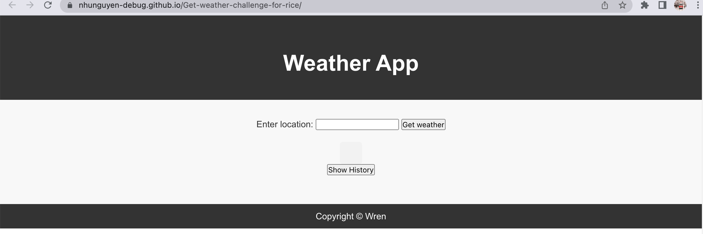

# Weather Daily
theme: jekyll-theme-Weather Daily
## Overview

Weather Daily is a weather dashboard application that allows users to quickly access current and future weather conditions for multiple cities. It provides a user-friendly interface for travelers and anyone interested in checking the weather outlook for planning purposes. Users can search for a city, view current weather conditions, see a 5-day weather forecast, and access their search history.

## Functionality

Weather Daily offers the following key features:

1. **City Search**: Users can search for a city by entering its name into the search bar.

2. **Current Weather Display**: Upon searching for a city, the application presents users with the following information for the selected city:
   - City name
   - Date
   - Icon representation of weather conditions
   - Temperature
   - Humidity
   - Wind speed

3. **5-Day Weather Forecast**: Users can also view the future weather conditions for the selected city. The 5-day forecast includes:
   - Date
   - Icon representation of weather conditions
   - Temperature
   - Wind speed
   - Humidity

4. **Search History**: The application keeps a record of previously searched cities, allowing users to quickly access current and future conditions for any city in their search history.

## User Story

As a traveler, you can use Weather Daily to see the weather outlook for multiple cities, helping you plan your trips accordingly. Whether you're planning a vacation or a business trip, Weather Daily provides you with the weather information you need to make informed decisions.

## Accessing the Application

You can access the deployed version of Weather Daily by following this link: [Weather Daily - Deployed](https://nhunguyen-debug.github.io/RiceWeatherQuest/)

To explore the source code and contribute to the project, visit the GitHub repository: [Weather Daily - GitHub](https://github.com/nhunguyen-debug/Get-weather-challenge-for-rice.git)

## Screenshots

## How to Use

1. Open the Weather Daily application using the deployed link provided above.

2. Enter the name of the city you want to check the weather for in the search bar.

3. Click the search button.

4. View the current weather conditions and the 5-day forecast for the selected city.

5. To access your search history, simply click on a city name in the search history section, and the weather information for that city will be displayed.

## Contributions

Contributions to Weather Daily are welcome. If you have suggestions for improvements or would like to report issues, please use the GitHub repository's issue tracker.

## License

This project is licensed under the MIT License - see the [LICENSE](LICENSE) file for details.

---

Thank you for using Weather Daily! We hope it helps you plan your journeys with ease.
